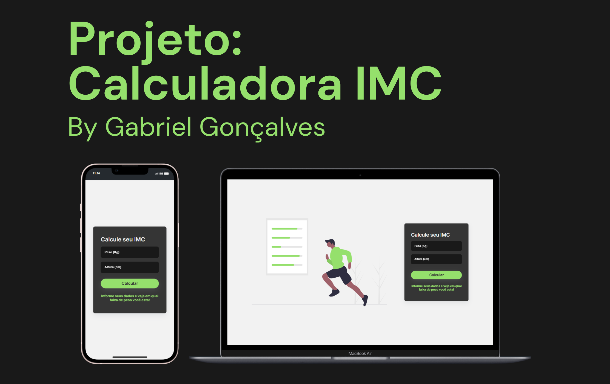
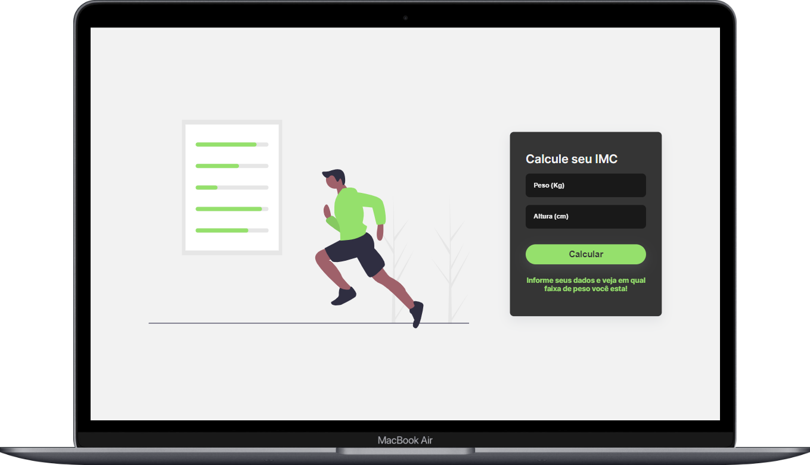

<h1 align="center">
  Calculadora de IMC
</h1>

  <a href="#-layout">Layout</a>&nbsp;&nbsp;&nbsp;|&nbsp;&nbsp;&nbsp;
  <a href="#-tecnologias">Tecnologias</a>&nbsp;&nbsp;&nbsp;|&nbsp;&nbsp;&nbsp;
  <a href="#-projeto">Projeto</a>&nbsp;&nbsp;&nbsp;|&nbsp;&nbsp;&nbsp;
  <a href="#-licença">Licença</a>&nbsp;&nbsp;&nbsp;|&nbsp;&nbsp;&nbsp;
  <a href="#-contato">Contato</a>

 

 
   

## 🎨 Layout

Aqui você pode conferir o layout do projeto.  

[👉 Link para visualizar a pagina completa]()

 

 

---

## 🚀 Tecnologias

Esse projeto foi desenvolvido com as seguintes tecnologias:

 
 
 

## 💻 Projeto

Web aplicativo criado com as tecnologias <strong> HTML, CSS, JavaScript</strong>. Isso garantindo uma experiência de usuário simplificada e <strong>responsiva</strong>, que se adapta a todos os dispositivos, <strong>desde desktops até smartphones</strong>.

## 📝 Licença

Esse projeto está sob a licença MIT. Veja o arquivo [LICENSE](LICENSE) para mais detalhes.

## 🌐 Contato

 

---

Feito com ♥ by Gabriel Gonçalves 🖖 &nbsp;&nbsp;&nbsp;|&nbsp;&nbsp; <a href="#--do-your-task-please--">Voltar para o Inicio ⬆️ </a>
